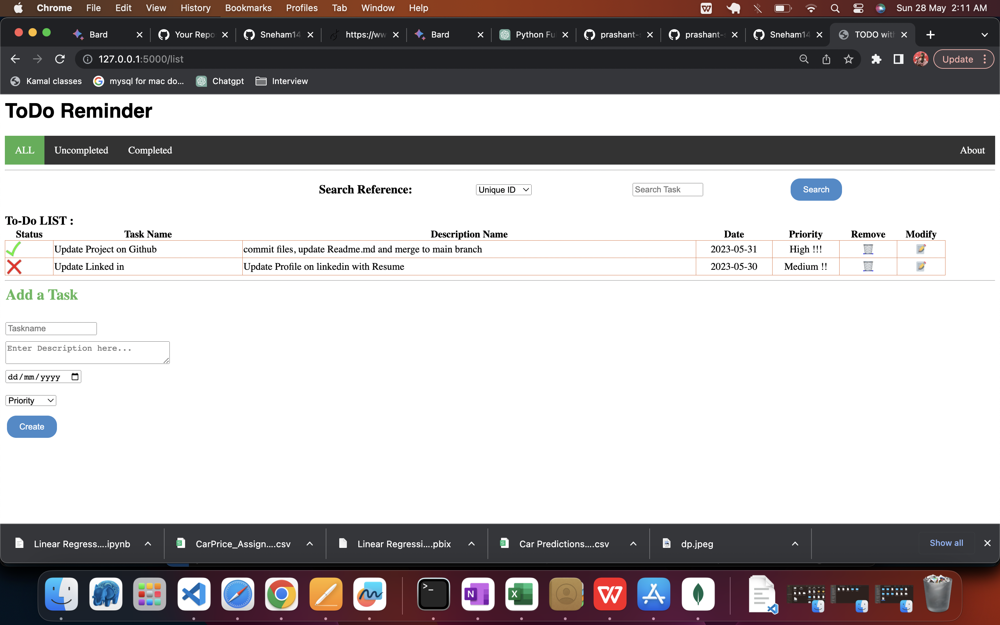
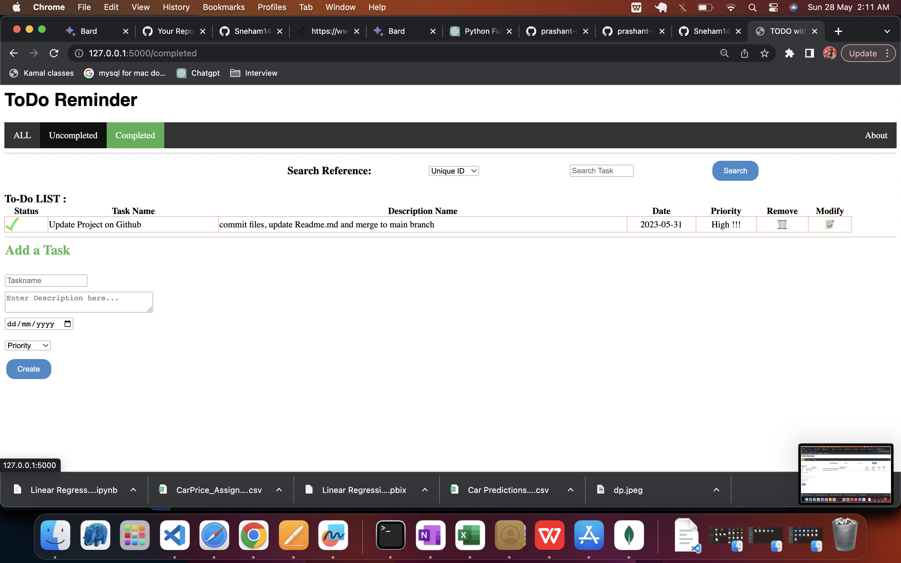
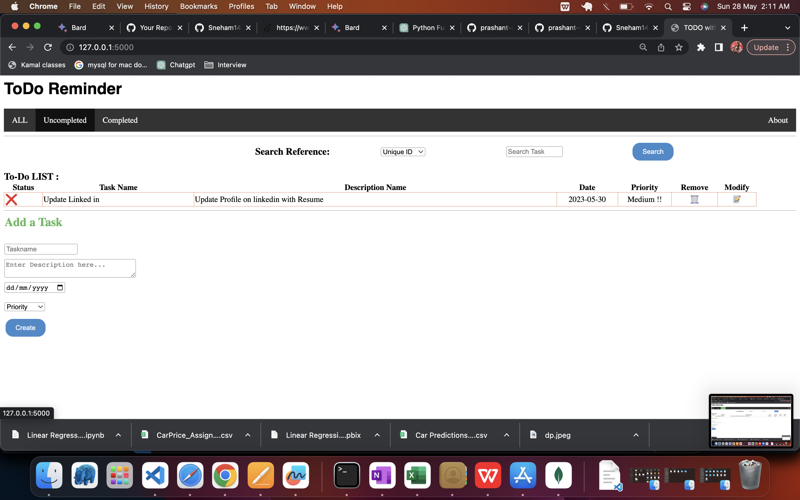

# ToDoApplication

The Todo Application is a web-based task management system that allows users to store and organize their important tasks. Users can set task priorities (high, medium, low), update task status (complete or not complete), and edit task details and descriptions. The application utilizes the Flask framework for backend development and MongoDB as the database for efficient data storage and retrieval.

Features
Task Creation: Users can create new tasks by providing a title, description, and priority level (high, medium, low).

Task Management: Users can update the status of tasks, marking them as complete or not complete.

Task Editing: Users have the option to edit task details and descriptions, allowing for modifications and refinements.

Data Storage: The application utilizes MongoDB, a powerful NoSQL database, for storing and managing tasks efficiently.

CRUD Operations: Basic CRUD (Create, Read, Update, Delete) operations are performed on tasks through the user interface using basic HTML and CSS.

User-Friendly Interface: The application provides a straightforward and intuitive user interface for seamless task management.

Technologies Used
Flask: A lightweight web framework in Python for backend development.
MongoDB: A NoSQL database for efficient storage and retrieval of task data.
HTML and CSS: Used for building the user interface and styling the application.

1. Alltasks

2. CompleteTask

3. IncompleteTask

